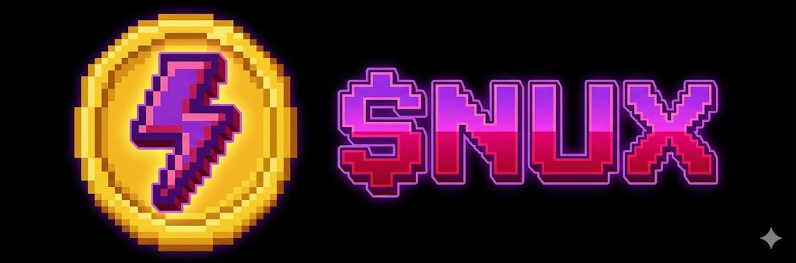

<div align="center">



# NuxChain: The Future of Web3 Data & Gamified DeFi

[](https://opensource.org/licenses/MIT)
[](https://www.typescriptlang.org/)
[](https://reactjs.org/)
[](#)

> **Advanced Web3 platform merging Artificial Intelligence, Gamified Staking, and a deflationary Burn-to-Earn ecosystem.**

[Website](https://nuxchain.com) • [Whitepaper](public/docs/Nuxchain_Whitepaper.pdf) • [Community](#-community) • [Documentation](doc/README.md)

</div>

---

## 🌟 Vision & Mission

NuxChain bridges the gap between complex on-chain data and actionable insights through its proprietary AI assistant, **Nuxbee**. We aim to redefine decentralized finance by moving away from traditional yield farming and introducing a sustainable **Burn-to-Earn** circular economy. 

Our mission is to empower users with an interactive, transparent, and gamified DeFi experience where active participation is rewarded with dynamic "Skills" (NFTs) that enhance their earning potential and platform utility.

---

## 🔥 Core Ecosystem Mechanics

### 1. Gamified Smart Staking
Experience DeFi like never before. NuxChain introduces **Staking Skills**—dynamic NFTs that users unlock based on their ecosystem participation. These skills provide variable APY boosts and special platform privileges, transforming static staking into an active strategy game.

### 2. Burn-to-Earn Deflationary Model
Sustainability is at our core. A percentage of all transaction fees and interactions within the platform are permanently burned. This direct link between platform activity and token scarcity creates a robust deflationary model, preserving long-term value for `$NUX` holders.

### 3. Nuxbee AI Assistant
Navigating Web3 data shouldn't be difficult. **Nuxbee**, powered by advanced AI, provides users with real-time interpretation of on-chain activities, market sentiment analysis, and intelligent staking portfolio optimizations, right from the dashboard.

### 4. Transparent Treasury Health
We believe in absolute transparency. NuxChain features a public **Treasury Health** dashboard, allowing the community to monitor the protocol's backing, fee routing, and resource allocation in real-time on the blockchain.

---

## 💎 The $NUX Token

The `$NUX` token is the central utility and incentive asset powering the NuxChain ecosystem.

**Key Utilities:**
- **Stake & Earn:** Lock `$NUX` in our Enhanced Smart Staking protocol to earn yields and unlock NFT Skills.
- **AI Access:** Burn or stake `$NUX` to access premium analytics and predictive modeling via Nuxbee.
- **Ecosystem Fuel:** Required for marketplace interactions, avatar minting, and Burn-to-Earn participation.
- **Governance (Upcoming):** Propose and vote on protocol parameters, treasury allocations, and future roadmap features.

---

## 🚀 Tech Stack

NuxChain is built using industry-standard, high-performance technologies to ensure security, scalability, and an exceptional user experience on desktop and mobile.

- **Frontend:** React 19, Vite, TailwindCSS 4.0, Framer Motion
- **Web3 Integrations:** Wagmi, Viem, WalletConnect (EVM & Solana support)
- **Backend & Data:** Vercel Serverless, The Graph (Subgraphs), Firebase/Firestore
- **AI Infrastructure:** Google Gemini API (v2.5 Flash)
- **Smart Contracts:** Solidity (Polygon Network deployed)

For exhaustive architecture details, visit the [Tech Stack Guide](doc/STACK.md).

---

## 🛠️ Getting Started for Developers

We welcome contributors and builders to expand the NuxChain ecosystem. 

### Prerequisites
- Node.js v20+
- pnpm v9+ (recommended)
- Web3 Wallet (MetaMask, OKX, etc.)
- WalletConnect Project ID for local dev

### Quick Setup

```bash
# 1. Clone the repository
git clone https://github.com/LennyDevX/nuxchain-app.git
cd nuxchain-app

# 2. Install dependencies
pnpm install

# 3. Configure environment variables
cp .env.example .env
# Make sure to populate your Alchemy, WalletConnect, and AI keys in .env

# 4. Start the development server
pnpm dev
```
Access the local dApp at `http://localhost:5173/`. Detailed guidelines are available in our [Contributing Guide](doc/CONTRIBUTING.md).

---

## 🔐 Security & Auditing

Security is our top priority. The NuxChain repositories observe strict auditing practices:
- **Smart Contracts:** Deployed logic undergoes continuous internal review. External audits are planned for major protocol upgrades.
- **Non-Custodial:** User funds and private keys are never requested or stored by the NuxChain web interface.
- **Bug Bounty:** Found a vulnerability? Please contact us securely at `security@nuxchain.com`.

---

## 🌐 Community 

Join the revolution of AI-driven DeFi. Connect with the core team and fellow community members:

- **Twitter / X:** [@nuxchain](https://twitter.com/nuxchain)
- **Discord:** [Join the Server](https://discord.gg/nuxchain)
- **Website:** [nuxchain.com](https://nuxchain.com)

---

<div align="center">
  <p>Built with 💜 for the decentralized future.</p>
  <p><br><em>© 2026 NuxChain. All rights reserved.</em></p>
</div>
