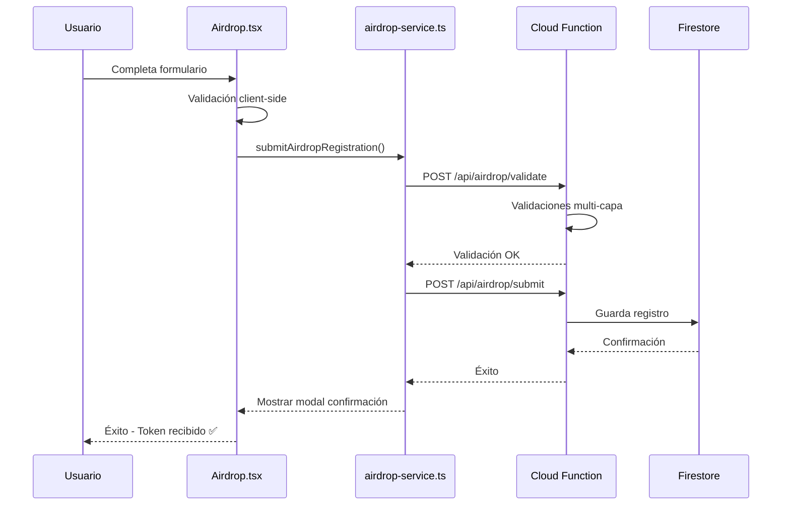

# 🎯 Airdrop Registration System

Sistema completo de registro para el airdrop de 20 POL tokens con validaciones de seguridad y manejo de errores mejorado.

---

## 📋 Overview

Los usuarios se registran con:
- **Nombre** (mínimo 3 caracteres)
- **Email** (validación de formato y duplicados)
- **Wallet Address** (EVM o Solana)
- **Network** (Polygon o Solana)

Reciben: **20 POL tokens** que pueden usar para hacer staking en la plataforma.

---

## ✨ Features

### User Experience
- ✅ Formulario simple y moderno con validación en tiempo real
- ✅ Conexión de wallet integrada (auto-fill de dirección)
- ✅ Validación de duplicados (wallet y email únicos)
- ✅ Animaciones fluidas y responsive design
- ✅ Feedback visual inmediato (success/error states)
- ✅ Modal de confirmación con detalles del airdrop
- ✅ Optimizado para mobile-first

### Technical Features
- ✅ TypeScript con type safety completo
- ✅ Integración con Wagmi v2 para wallet connection
- ✅ Firebase Firestore para persistencia de datos
- ✅ Validación client-side y server-side
- ✅ Lazy loading y code splitting
- ✅ SEO optimizado

### Security Features
- ✅ Captura de fingerprint de dispositivo
- ✅ Información de navegador y OS
- ✅ Device fingerprinting avanzado
- ✅ Detección de IP farms
- ✅ Validación on-chain de wallets
- ✅ Rate limiting (3 registros/hora por IP)
- ✅ Mensajes de error específicos para debugging

---

## 🗂️ File Structure

```
src/
├── pages/
│   └── Airdrop.tsx                    # Página principal del airdrop
├── components/
│   └── forms/
│       └── airdrop-service.ts         # Servicio de Firestore y API
├── router/
│   └── routes.tsx                     # Configuración de rutas
└── styles/
    └── globals.css                    # Animaciones CSS

api/
├── airdrop/
│   ├── validate-and-register.ts       # Cloud Function con validaciones
│   └── routes.ts                      # Rutas POST /validate y /submit
├── types/
│   └── index.ts                       # TypeScript interfaces
└── index.ts                           # Express app

doc/
├── AIRDROP_FIRESTORE_SETUP.md         # Configuración de Firestore
└── AIRDROP_REGISTRATION_SYSTEM.md    # Este archivo
```

---

## 🚀 Quick Start

### 1. Configure Firebase

Variables de entorno necesarias en `.env`:

```env
VITE_FIREBASE_API_KEY=your_api_key
VITE_FIREBASE_AUTH_DOMAIN=your_project.firebaseapp.com
VITE_FIREBASE_PROJECT_ID=your_project_id
VITE_FIREBASE_STORAGE_BUCKET=your_project.appspot.com
VITE_FIREBASE_MESSAGING_SENDER_ID=your_sender_id
VITE_FIREBASE_APP_ID=your_app_id
VITE_SOLANA_RPC_MAINNET=your_solana_rpc_url (opcional)
```

### 2. Setup Firestore Security Rules

Ver instrucciones detalladas en [AIRDROP_FIRESTORE_SETUP.md](./AIRDROP_FIRESTORE_SETUP.md)

### 3. Access the Page

La página está disponible en: `/airdrop`

---

## 📱 User Flow



### Paso a Paso

1. **Usuario visita `/airdrop`**
   - Ve información del airdrop de 20 POL
   - Lee los beneficios y características

2. **Completa el formulario**
   - Ingresa nombre (mínimo 3 caracteres)
   - Ingresa email válido
   - Conecta wallet o ingresa dirección manualmente
   - Selecciona network (Polygon o Solana)

3. **Validación automática (Client-Side)**
   - Verifica formato de email
   - Valida dirección de wallet (0x... para EVM, Base58 para Solana)
   - Genera fingerprint del dispositivo
   - Captura información del navegador

4. **Envío a Backend**
   - POST /api/airdrop/validate
   - Validaciones multi-capa (ver abajo)

5. **Si Validación Exitosa**
   - POST /api/airdrop/submit
   - Firestore escribe registro
   - Modal de confirmación aparece
   - Usuario recibe feedback positivo

6. **Siguiente Paso (Futuro)**
   - Smart contract distribuye 20 POL tokens
   - Usuario puede hacer staking en `/staking`

---

## 🔒 Validaciones de Seguridad

### Level 1: Client-Side (Prevención de Bots Básica)
```typescript
// Validación de formato
- Email válido
- Wallet válido (checksum)
- Nombre mínimo 3 caracteres

// Honeypot (campo oculto)
- Campo "_confirm" debe estar vacío
- Si está lleno =Bot detectado

// Device fingerprinting
- Canvas fingerprint
- User agent
- Browser info (nombre, versión, OS)
- Screen resolution
- Timezone
- Language
```

### Level 2: Email Validation (API)
```typescript
// Validaciones
- Formato válido
- No es email disposable (guerrillamail, tempmail, etc)
- No está duplicado en Firestore

// Disposable Email Providers (~200+ detectados)
- tempmail.com, guerrillamail.com, mailinator.com
- 10minute.email, throwaway.email
- mailnesia.com, temp-mail.org
- Y muchos más...
```

### Level 3: Wallet Validation (API)
```typescript
// EVM (Polygon)
- Dirección válida (0x...)
- Checksum correcto
- On-chain existe y tiene balance > 0

// Solana
- Dirección Base58 válida
- On-chain existe
- Saldo mínimo: 0.001 SOL (solo para prevención de bots)
- Fallback a múltiples RPC endpoints si falla

// Ambos
- No está duplicada en Firestore
- Wallet no está en lista negra
```

### Level 4: IP & Device Analysis (API)
```typescript
// IP Validation
- No es data center (AWS, Azure, Google Cloud)
- No es proxy o VPN
- Máximo 3 registros por IP (rate limiting)
- No es IP sospechosa (geoIPTrust)

// Device Fingerprinting
- Validación de fingerprint único
- Máximo 3 registros por fingerprint
- Detección de UA falsificado
```

### Level 5: Rate Limiting (API)
```typescript
// Límites
- 3 registros por IP por hora
- 1 registro por wallet por día
- 1 registro por email por día
- 5 registros por fingerprint por día

// Timeout extendido
- 30 segundos (antes: 10s)
- Para conexiones lentas y RPC de Solana
```

---

## 📊 Datos Capturados en Firestore

### Estructura Principal
```typescript
{
  // Información de registro
  id: string;                           // UID único
  name: string;                         // Nombre del usuario
  email: string;                        // Email (único)
  wallet: string;                       // Dirección de wallet (única)
  network: 'polygon' | 'solana';       // Network elegida
  
  // Información técnica
  ipAddress: string;                    // IP del usuario
  userAgent: string;                    // User Agent del navegador
  fingerprint: string;                  // Device fingerprint
  browserName: string;                  // Chrome, Firefox, Safari, etc
  browserVersion: string;               // 120.0
  osName: string;                       // Windows, macOS, Linux
  osVersion: string;                    // 10, 11, etc
  deviceType: 'mobile' | 'desktop';    // Tipo de dispositivo
  screenResolution: string;             // 1920x1080
  timezone: string;                     // America/New_York
  language: string;                     // en-US, es-ES
  
  // Timestamps y estado
  createdAt: Timestamp;                 // Timestamp de creación
  status: 'pending' | 'approved';      // Estado del registro
  airdropAmount: number;                // Siempre 20 (POL)
  
  // Análisis de seguridad
  securityScore?: number;               // 0-100 (100 = muy seguro)
  riskFlags?: string[];                 // ['suspicious_ip', 'new_device']
  submittedAt: Timestamp;               // Cuando se envió
}
```

---

## 🔧 Manejo de Errores Mejorado

### Mensajes Específicos

#### Errores de Validación
```
❌ "Email already registered. Please use a different email."
❌ "Wallet already registered. Please use a different wallet."
❌ "Disposable email not allowed. Please use a real email."
❌ "Invalid email address format."
❌ "Invalid wallet address."
❌ "This wallet has insufficient balance. Minimum: 0.001 SOL"
```

#### Errores Técnicos
```
❌ "Network error. Please check your internet connection."
❌ "Timeout after 30 seconds. Please try again."
❌ "Database configuration error. Please refresh."
❌ "Access denied. Please contact support."
❌ "Security error. Please disable ad blockers or VPN."
```

#### Rate Limiting
```
❌ "Too many requests. Please try again in 1 hour."
```

### Logging Mejorado

Frontend logs (F12 Console):
```typescript
🚀 Submitting airdrop registration...
Form data: { name, email, wallet, network }
✅ Registration successful!
❌ Registration error: [error message]
Error type: [constructor name]
```

API logs (Cloud Function):
```typescript
📝 Incoming validation request
📧 Email check: OK / DISPOSABLE / DUPLICATE
💰 Balance check: OK / INSUFFICIENT / FAILED
🤖 Bot detection: PASSED / FLAGGED
✅ Validation passed
❌ Validation failed: [reason]
```

---

## 🧪 Testing & Debugging

### Test Wallets (Polygon Testnet)

```
✅ 0x742d35Cc6634C0532925a3b844Bc966e6F9e37f1  # Valid test wallet
```

### Test Emails

```
❌ user@tempmail.com                            # Disposable
❌ test@guerrillamail.com                       # Disposable
✅ user@gmail.com                               # Real
✅ user@company.com                             # Real
```

### Debugging Commands

```bash
# Ver todos los registros
npx firebase firestore export /tmp/firestore-backup --project=your-project

# Ver registros con riesgo alto
firebase emulator:firestore --data=/path/to/data

# Limpiar registros de prueba
npx ts-node scripts/delete-registration.cjs
```

---

## 🚀 Deployment Checklist

- [ ] Firebase configured with correct API keys
- [ ] Firestore security rules deployed
- [ ] Cloud Function deployed and tested
- [ ] Environment variables in production
- [ ] Email validation list updated
- [ ] Rate limiting configured
- [ ] Monitoring enabled
- [ ] Backup strategy in place

---

## 📚 Documentación Relacionada

- [AIRDROP_FIRESTORE_SETUP.md](./AIRDROP_FIRESTORE_SETUP.md) - Configuración de BD
- [BOT_SECURITY.md](./BOT_SECURITY.md) - Sistema de seguridad anti-bot
- [AIRDROP_COMPLETE_GUIDE.md](./AIRDROP_COMPLETE_GUIDE.md) - Guía completa del airdrop

---

## 🆘 Troubleshooting

### "Email already registered"
**Solución:** Usuario intentó registrarse dos veces
- Verificar en Firestore si email existe
- Si es error falso: limpiar colección de airdrop

### "Network error. Please check your internet connection"
**Causas posibles:**
1. Servidor API no responde
2. Problema de conexión del usuario
3. CORS bloqueado
4. Firewall bloqueando peticiones

**Solución:** Verificar logs en Cloud Function

### "Timeout after 30 seconds"
**Causas posibles:**
1. RPC de Solana muy lento
2. Firestore bajo carga
3. Conexión del usuario lenta

**Solución:** Aumentar timeout (línea 30 en airdrop-service.ts)

### "Invalid wallet address"
**Verificar:**
1. Formato correcto (0x... para EVM, Base58 para Solana)
2. Checksum válido
3. No caracteres especiales

---

## 📞 Soporte

Para reportar errores:
1. Copia logs de la consola (F12)
2. Incluye el wallet address y email
3. Crea issue en GitHub con los detalles

---

**Última actualización:** 3 de Febrero, 2026  
**Estado:** ✅ Producción  
**Mantenedor:** Lenny DevX
